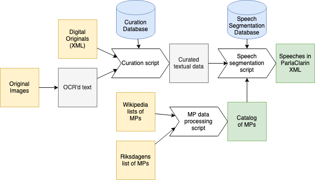
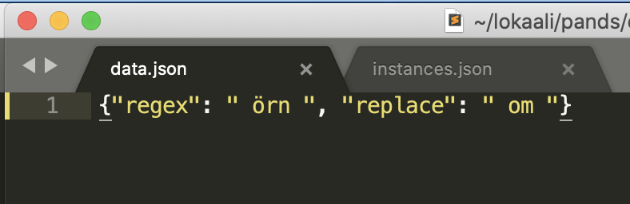
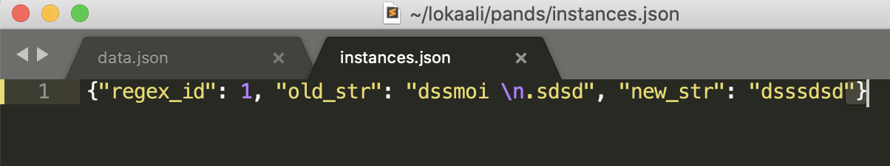

# Processing the parliamentary proceedings

_Westac Project, 2020_

## Overview

The primary objective of the project is to process both digital speech records and scanned images of parliamentary proceedings, curate the data and segment it into speeches. Additionally, a catalog of the MPs will be created and linked to the speeches.

The general flow of the process is the following:



*Input data in yellow, scripts in white, processing databases in blue, intermediary formats in gray, end products in green.*

## 1. Gathering the data

### Digital originals 1990s ->

Original data already in XML format are available from 1993-01-01 and onward. We will parse all available current data. These are located at: 
https://data.riksdagen.se/data/dokument/

Additionally, all parliamentary data can be accessed at https://betalab.kb.se/

### OCR'd text

Earlier parlimentary proceedings from the bicameral era (up until 1970) are available as PDFs at: https://riksdagstryck.kb.se/tvakammarriksdagen.html 

Proceedings from the unicameral era are available at (1970–>) https://data.riksdagen.se/data/dokument/

In the initial curation, the data we are going to use are the parlimentary proceedings from 1945-01-01 until 1992-12-31. Later on, proceedings from 1920 to 1945 will be added.

As with the digital originals, all parliamentary data can be accessed at https://betalab.kb.se/


## 2. Curation

The OCR'd texts have quite a bit of artifacts that need to be handled. A simple approach would be to use scripts with regular expressions, much like previous approaches to curation. The problem with this common approach is three-fold:
1. Regular expressions can change to many instances. An example of this would be to match all **" örn "** and swap them with **" om "**. In most cases this is a correct change, but not in all cases. Although, changing a regular expression might change many parts of the data. It is also hard to track what exact changes that are made in the curation step.
2. Running a script with regular expressions is inherently serial in nature. Running the script in different order might create different results.
3. If we create a new language model to for curation, we would need to store either the model or rerun the model if data would be reOCR:ed.

Hence, we suggest the use of a curation database instead. Most of the text errors are OCR specific, and so is the corresponding mitigation. To be able to keep track of what we change, both the patterns and the instances where we apply these patterns are kept in JSON files. In the code, these can be directly read to pandas and applied to the raw, original OCR:ed data. As with general annotation in Natural Language Processing, keeping the curation separate from the actual data and code is following the principles for annotation of textual data [(Pustejovsky and
Stubbs 2013)](https://www.amazon.com/Natural-Language-Annotation-Machine-Learning/dp/1449306667), for which curation can be seen as a special case.

The design choices, that can be easily checked are:
1. All instances of curations (changes in the data) should be independent of each other. This means that the individual instances should not depend on other previous curations.
2. All instances of curations are stored and version controlled.
3. All curated instances should map toward the original source, not the OCR'd files. I.e. if we change the OCR output, the curation instances 
4. If all words are curated, the whole text is essentially stored in the curation database.

The database of the expressions would look something like this



while the database of the instances would look like this



The examples are single rows/entries in the database.

In addition to the OCR errors, the proceedings contain some metadata that might complicate the processing of the proceedings. These include titles, dates, footnotes, page numbers et cetera. These should be detected, and either converted to ParlaClarin format, or dropped altogether. Segment coordinates obtained from the OCR process can be useful in differentiating metadata from the speeches.

### 2.2 Speech segmentation

Due to etiquette and the structuring of the protocols, the beginnings of speeches are very regular. To locate them in the data, regular expressions can be used, matching something like

```
herr [...] :
Anf. [...] :
```

This is relatively straightforward to implement in python:

```python
# 'herr [...] :'
expression_1920 = re.compile("\nherr [a-zäöå0-9., ]{0,60}:")
# 'Anf. [...] :'
expression_2020 = re.compile("Anf.[a-zäöåA-Z0-9.,()  ]{0,60}:")
```

As different patterns are necessary for all time periods and chambers, the number of patterns to be matched is going to be large and their application convoluted. A similar database like structure as for the OCR corrections would be good.

In comparison to the Finnish proceeding format, the Swedish one seems a little less structured. The Finnish implementation could subsequently rely on the structure for finding the *ending* of each speech. In our case, the end is not necessarily clearly marked. We need to skim through data and find any regularities in the endings if possible. If there are multiple patterns in which a speech can end, they can all be searched through.

If there are no clear regularities, we need to implement a machine learning approach with training and validation data. The actual algorithm can be relatively straightforward. For instance, if a reasonably reliable split into chapters exists, a simple classification to END_CHPT and CONT_CHPT eg. with a sum of pretrained word embeddings is probably applicable. The *instances* of these matches could then be stored in the same database like structure as the regex matches.

## 3. Create a metadata catalog

[Wikipedia](https://sv.wikipedia.org/wiki/Listor_%C3%B6ver_ledam%C3%B6ter_av_Sveriges_riksdag) is currently the most extensive digital collection of data on historical Swedish MPs. While there are surely gaps, its current scope would be useful in many applications. Additionally, a (presumably comprehensive) list of the MPs can be found at https://data.riksdagen.se/data/ledamoter/ from 1990 onwards.

A separate database for the metadata is probably the way to go. The speeches would have minimal distinguishing information and metadata could be fetched if necessary. For other purposes, the metadata catalog might be useful on its own.

## 4. Format the data in the [Parla-CLARIN](https://github.com/clarin-eric/parla-clarin/) format

The format seems to encompass everything we need, and much more. Moreover, the structure of the speeches etc. translates nicely into Parla-CLARIN.

The speakers need to be mapped onto the entries of the metadata catalog. There might be some ambiguity concerning this part. Apart from that, this is mostly a plain software engineering task.

Asymptotically, conversions from Parla-CLARIN to other formats might be useful.

## 5. A manually annotated testset

For quality assurance, we should manually label a small set of 50 speeches (or paragraphs, chapters) to be able to asses the quality of curated data. This is more or less done when we have a first corpus available.

## End product

- Speeches in Parla-Clarin format
- Structured catalog of MPs and their information
- List of curation instances of the data, by type *and* by instance. These could be stored and "version controlled" using git LFS.
- List of speech beginning and ending matches, by type *and* by instance. Git LTS applicable here as well.
- Test set consisting of images of text and with corresponding correct  transcriptions

