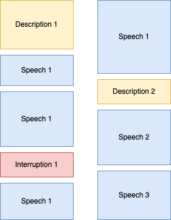

# Protocol annotation



*Potential structure of a document. A box denotes a paragraph, which can fall into one of three categories: speech, description or interruption.* 

There should be a PDF scan of the page, as well as two text files in the folder:

- original.txt

- annotated.txt

The original file is for reference and future use, and should not be edited. The other file, annotated.txt, should have all OCR errors, missing line breaks, and so on corrected, as well as margin notations etc. removed. Incorrect or misspelled words should be replaced with correct ones, and not marked per se, in the following manner:

original.txt

```
Page 10 Noisesss in the porliamentary hall. 
  New session starts.
```

annotated.txt

```
Noises in the parliamentary hall.

New session starts.
```

Note that new paragraphs should be marked with two RETURN.

In addition to the corrections, the ends and the beginnings of speeches should be annotated. This is done by adding the following all-caps words:

- Speeches:
  - BEGINSPEECH
  - ENDSPEECH
- Interruptions
  - BEGININTERRUPTION
  - ENDINTERRUPTION
- General description of events etc.
  - BEGINDESCRIPTION
  - ENDDESCRIPTION

Interuption is describing events taking place in the parliament, that are not a common part of the parlimentary protocol. 

```
Noises in the parliamentary hall. ENDDESCRIPTION

BEGINDESCRIPTION Senator Sanders from Vermont utters: ENDDESCRIPTION
BEGINSPEECH Mister Speaker, I would like to discuss the current state of American healthcare. ENDSPEECH

BEGINDESCRIPTION More noises in the parliamentary hall.
```

As seen in the example, the tags surround the whole speech, including the introduction of the speaker.

In the case there are interruptions within the speech, just annotate the interuption with a start and end tag as:

```
Noises in the parliamentary hall. ENDDESCRIPTION

BEGINDESCRIPTION President Obama utters: ENDDESCRIPTION BEGINSPEECH Dear Senators,
BEGININTERRUPTION A lot of boohs from the hall. ENDINTERRUPTION
Mister Speaker, I would like to discuss the current state of American healthcare. ENDSPEECH

BEGINDESCRIPTION There were a lot of sick sentators this day.
```

In case no speeches, interruptions or description begin in the page, no tags should be added.
